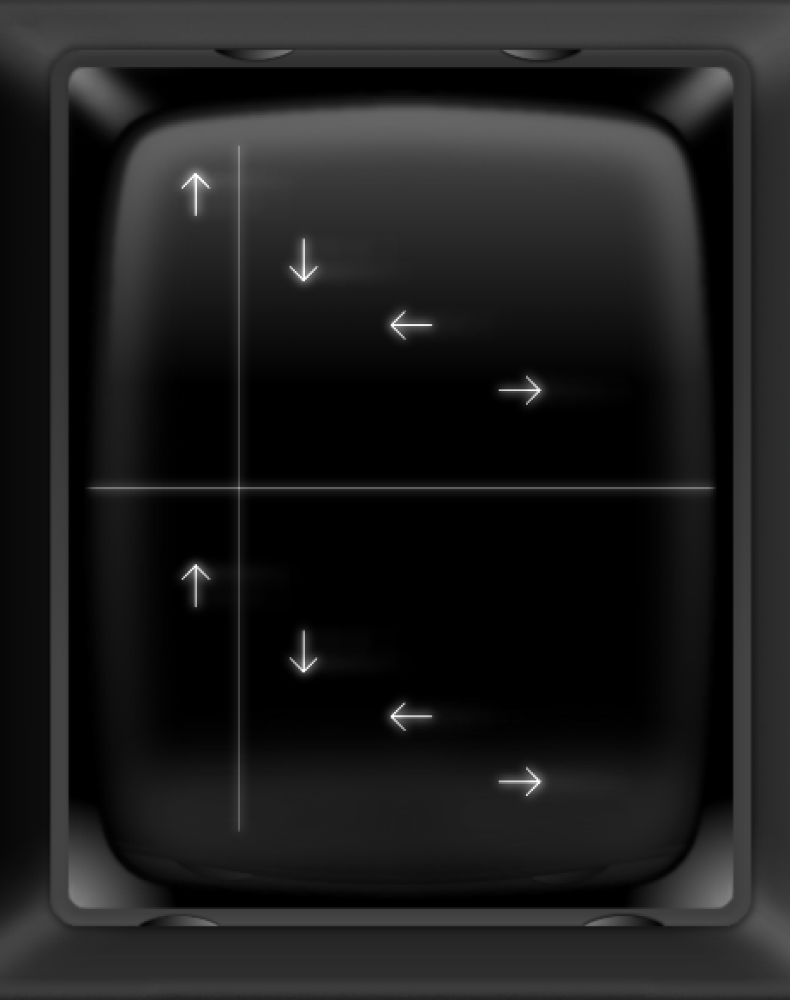
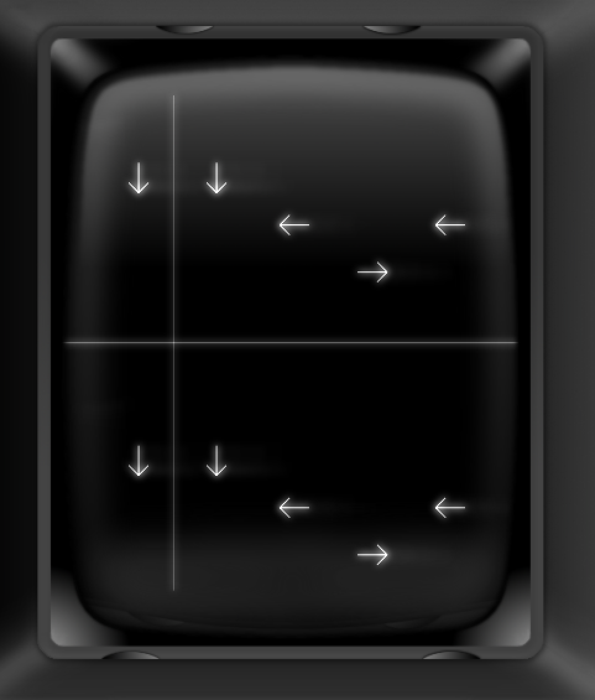

# Dance Dance Vec
A 2 player dance mat style game for the GCE / Milton Bradley Vectrex games console (circa 1982). 

Programmed mainly in C (with some Assembler) and developed in Xcode for Mac OSX. 
Although this game can be played with a standard controller it is recommended to make a set of custom dance mats. Instructions to do so will be supplied... eventually.

This project is currently a work in progress and has not (yet) been run a real Vectrex console; be aware that a software bug on a Vectrex has the potential to cause irreverisible damage to the Vectrex screen! Please use one of the many available Vectrex emulators (such as ParaJVE http://www.vectrex.fr/ParaJVE/) until this has been fully tested.
Here is the current bin file to run in your emulator of choice: [DanceDanceVec.bin](dancedancevec.bin)

This project will require song submissions from the community but these can be readily ported from the Atari ST, Amstrad and ZX-Spectrum 128k due to the common sound chip:
- https://www.youtube.com/watch?v=eSfoQKiXo5g
- http://en.wikipedia.org/wiki/General_Instrument_AY-3-8910
